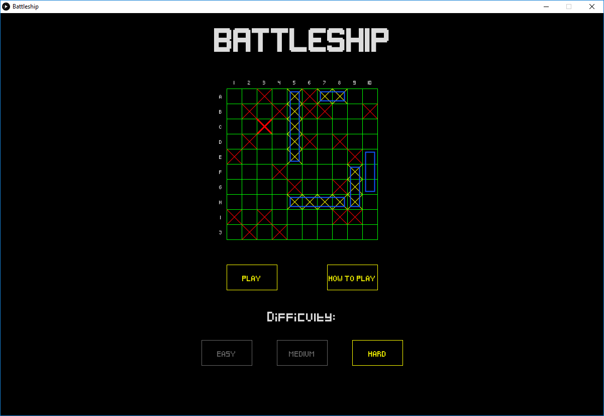
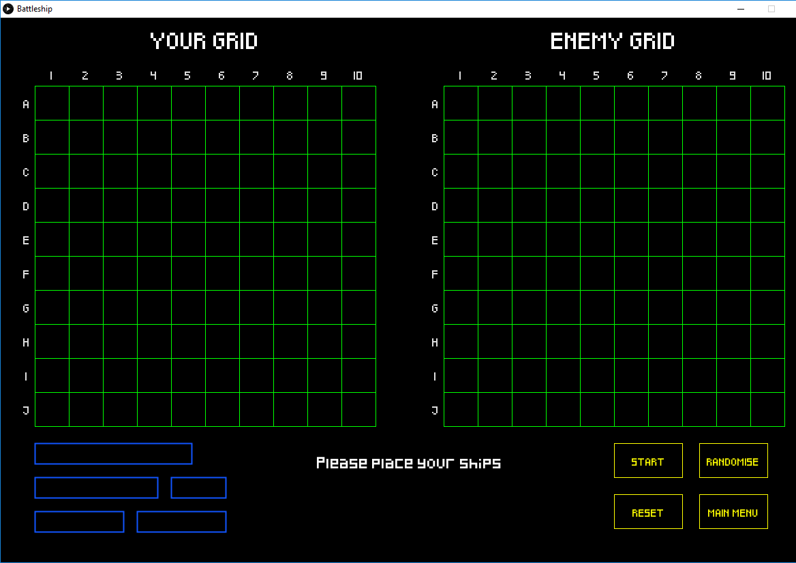
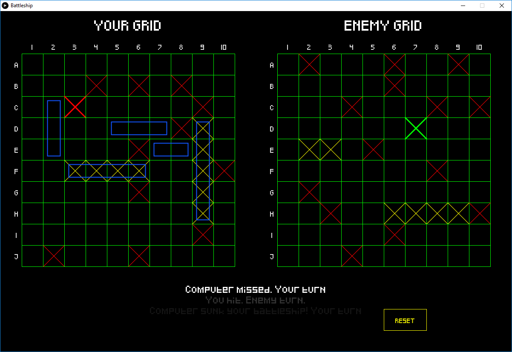

# Assignment 2 for OOP: Battleship Game
Name: Pádraig Redmond

Student Number: C15755659

## Video

## Screenshots
### Main Menu

### Game screen before starting

### Game screen during game

## Introduction
This is a single-player implementation of the classic game, Battleship, with a choice of three difficulties of AI to play against.

Note: Setting the debug flag to true prevents the AI from "thinking" before taking its turn. It's an artificial delay, and can get tedious to wait through if all you want to do is test it.

## Controls
The game is mostly mouse controlled.

When placing ships:
 Left click: Select/place ship
 Right click: Rotate selected ship.

During gameplay:
 Left click to target a cell.

When viewing the demo on the menu screen, you can speed up or slow down the AI by pressing the up or down arrows.

## How to play
From the main menu, you can select the difficulty of AI you will face.

From the game screen, you have the option to manually place your ships, or you can click the randomise button to randomly place them.

After all ships are placed, click the start button to begin.

From here, you and the AI take turns in shooting each other, with the end goal of sinking all 5 of the opponents ships.

A missed shot is show in red, a hit in green, and a sunk ship is turned entirely yellow.

## AI
The AI has three difficulty settings: easy, medium and hard.

### Easy
The easy setting stores a list of every possible targetable cell, and simply randomly picks one every turn, regardless of what has happened in previous turns.
It's obviously very bad, and should be reliably beaten by any slightly intelligent strategy.

### Medium
This stores the same list of targets as the easy AI. The difference is it has two states, seek and hunt.
It starts off in a seek state, where it randomly targets cells until it hits something.
At this point it stores the two vertical and two horizontal adjacent cells in two seperate lists, and enters the hunt state.
It then begins targeting the cells in the vertical list. Everytime it lands a hit, it adds the next adjacent cell in that direction to the start of the list.
If it exhausts the vertical list without sinking, it moves onto the horizontal list.

It's possible for other ships to be hit during this, as ships can be placed side by side.
To deal with this, after a ship is sunk the AI will check over the board to see if there are any cells that are hit, but not sunk.
If it finds one, it repeats the process above as though it had just hit that cell.

### Hard
Hard AI follows the exact same algorithm as medium, with the only difference being its list of targets.
Instead of storing every cell, it only stores every second square.
As the smallest ship is of size 2, this list of targets is guaranteed to hit every ship at least once, and after one hit the algorithm will find the rest of the ship.

### Randomised ship placement
The AI class deals with randomising ship placement both for itself and for the player.
It's fairly simple, as the grid already has a method to ensure a ship is being placed validly. All it does is continually try to place a ship until it succeeds, then moves on to the next ship.

## Other Notable Features

### Main Menu Demo
I couldn't decide how to present the main menu at first, as I don't have much artistic ability. In the end I decided to use it to display the most prominent feature of the game, the AI. 

It uses the Hard AI to perpetually generate and solve boards, and as mentioned above, it can be sped up or slowed down using the arrow keys.

### Info text
When playing, the outcome of the last 3 actions are displayed to the player. They are stored in a queue of string. Everytime a new string is added, the oldest is removed.

To make it clear which action happened most recently, that one is displayed in white, with the other two fading to grey as they get older.

### Ship Placement Checking
During setup, when holding a ship over the grid, the cell you hover over will highlight either red or green depending on whether the ship can be placed there.

To check if a position is valid, it first checks if it can physically fit in the grid at that position. If so, it checks every cell it would occupy, to ensure there isn't already a ship in that cell.

## Asset Credits

### Fonts
http://www.dafont.com/pixeled.font  
http://www.dafont.com/gameplay.font  
http://www.dafont.com/coolvetica.font  
